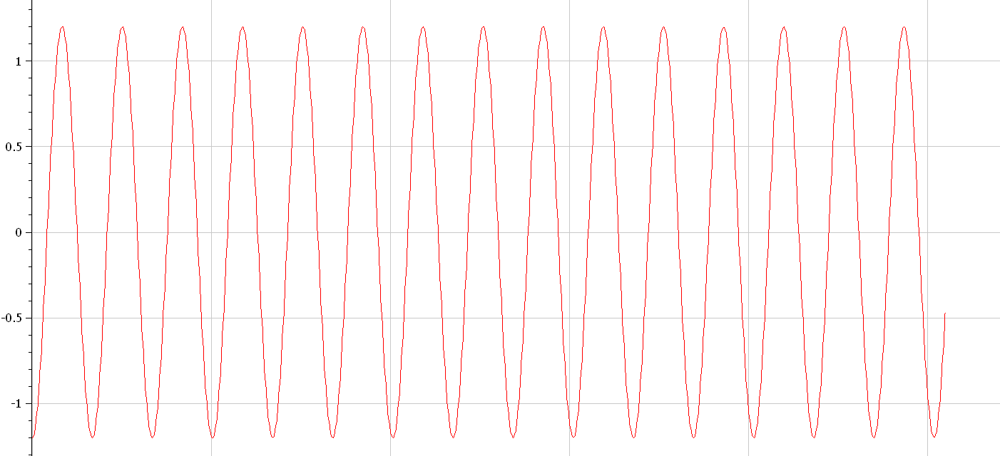
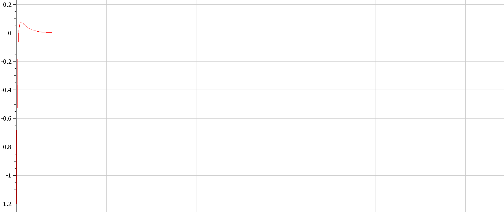

# Лабораторная работа №4
#### Syrov Vladislav 

#### НКНбд-01-19

#### RUDN University, 2022 Moscow, Russia

---
<!--_class: titleslide1 -->
#### Цели и задачи работы
Изучить уравнение гармонического осцилятора

---
<!--_class: titleslide2 -->
#### Задание к лабораторной работе
1.	Построить решение уравнения гармонического осциллятора без затухания
2.	Записать уравнение свободных колебаний гармонического осциллятора с затуханием, построить его решение. Построить фазовый портрет гармонических колебаний с затуханием.
3.	Записать уравнение колебаний гармонического осциллятора, если на систему действует внешняя сила, построить его решение. Построить фазовый портрет колебаний с действием внешней силы.

---
<!--_class: titleslide2 -->
#### Теоретический материал 
Движение грузика на пружинке, маятника, заряда в электрическом контуре, а также эволюция во времени многих систем в физике, химии, биологии и других науках при определенных предположениях можно описать одним и тем же дифференциальным уравнением, которое в теории колебаний выступает в качестве основной модели. Эта модель называется линейным гармоническим осциллятором.
Уравнение свободных колебаний гармонического осциллятора имеет следующий вид:
$$\ddot{x}+2\gamma\dot{x}+\omega_0^2=0$$

---
<!--_class: titleslide2 -->
При отсутствии потерь в системе ( $\gamma=0$ ) получаем уравнение консервативного осциллятора энергия колебания которого сохраняется во времени.
$$\ddot{x}+\omega_0^2x=0$$
Для однозначной разрешимости уравнения второго порядка необходимо задать два начальных условия вида
 
$$
 \begin{cases}
	x(t_0)=x_0
	\\   
	\dot{x(t_0)}=y_0
 \end{cases}
$$

---
<!--_class: titleslide2 -->
Уравнение второго порядка можно представить в виде системы двух уравнений первого порядка:
$$
 \begin{cases}
	x=y
	\\   
	y=-\omega_0^2x
 \end{cases}
$$

Начальные условия для системы примут вид:
$$
 \begin{cases}
	x(t_0)=x_0
	\\   
	y(t_0)=y_0
 \end{cases}
$$

---
<!--_class: titleslide2 -->
#### Условие задачи
Постройте фазовый портрет гармонического осциллятора и решение уравнения гармонического осциллятора для следующих случаев 
1. Колебания гармонического осциллятора без затуханий и без действий внешней
силы $\ddot{x}+3.5x=0$
2. Колебания гармонического осциллятора c затуханием и без действий внешней
силы $\ddot{x}+11\dot{x}+11x=0$
3. Колебания гармонического осциллятора c затуханием и под действием внешней
силы $\ddot{x}+12\dot{x}+x=2\cos{0.5t}$
На итнтервале $t \in [ 0; 51 ]$, шаг 0.05, $x_0=0, y_0=-1.2$

---
<!--_class: titleslide3 -->
#### Случай 1. Колебания гармонического осциллятора без затуханий и без действий внешней силы
$$\ddot{x}+3.5x=0$$
 рис.01

---
<!--_class: titleslide3 -->
#### Случай 1. Колебания гармонического осциллятора без затуханий и без действий внешней силы
$$\ddot{x}+3.5x=0$$
 рис.02

---
<!--_class: titleslide3 -->
#### Случай 2. Колебания гармонического осциллятора c затуханием и без действий внешней силы
$$\ddot{x}+11\dot{x}+11x=0$$
 рис.03

---
<!--_class: titleslide3 -->
#### Случай 2. Колебания гармонического осциллятора c затуханием и без действий внешней силы
$$\ddot{x}+11\dot{x}+11x=0$$
 рис.04

---
<!--_class: titleslide3 -->
#### Случай 3. Колебания гармонического осциллятора c затуханием и под действием внешней силы
$$\ddot{x}+12\dot{x}+x=2\cos{0.5t}$$
 рис.05

---
<!--_class: titleslide3 -->
#### Случай 3. Колебания гармонического осциллятора c затуханием и под действием внешней силы
$$\ddot{x}+12\dot{x}+x=2\cos{0.5t}$$
 рис.06

---
<!--_class: titleslide1 -->
#### Вывод

В ходе выполнения лабораторной работы были построены решения уравнения гармонического осциллятора и фазовые портреты гармонических колебаний без затухания, с затуханием и при действии внешней силы.
