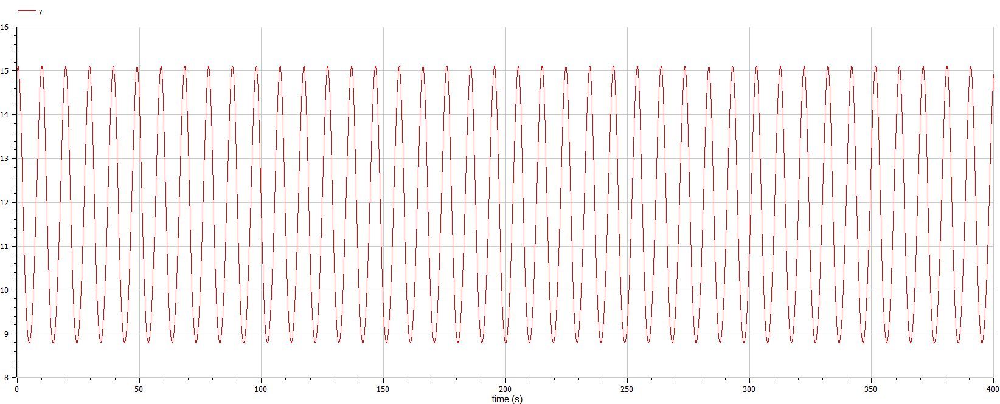
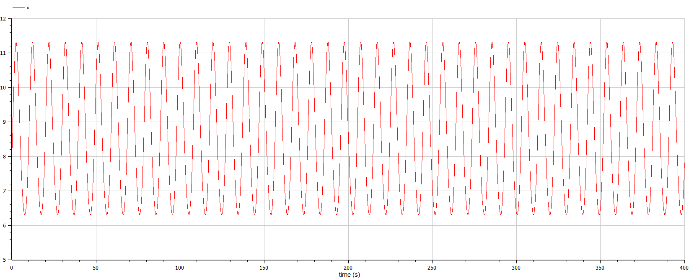
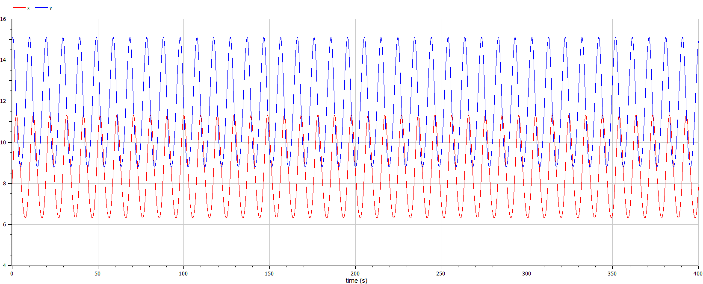
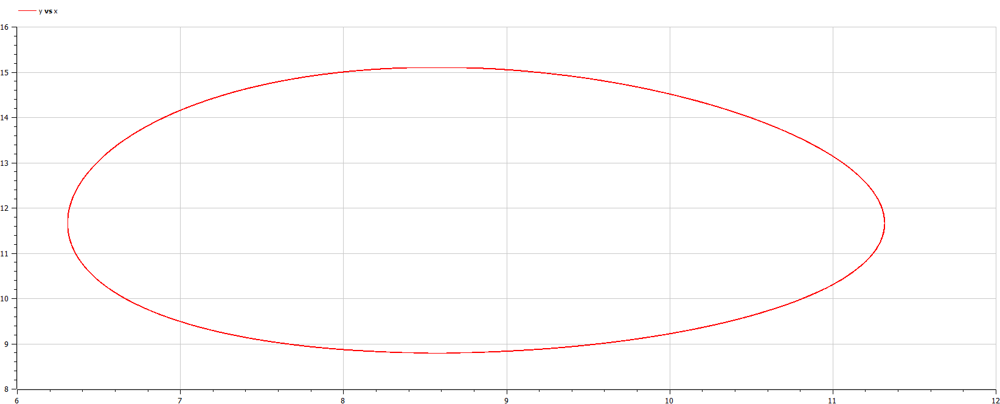

---
<!--_class: titleslide1 -->
#### Цель лабораторной работы

Изучить модель хищник-жертва

---
<!--_class: titleslide1 -->
#### Задание к лабораторной работе

1.	Построить график зависимости $x$ от $y$ и графики функций $x(t)$, $y(t)$
2.	Найти стационарное состояние системы

---
<!--_class: titleslide1 -->
#### Теоретический материал 

Рассмотрим базисные компоненты системы.

1.	Численность популяции жертв и хищников зависят только от времени (модель не учитывает пространственное распределение популяции на занимаемой территории)
2.	В отсутствии взаимодействия численность видов изменяется по модели Мальтуса, при этом число жертв увеличивается, а число хищников падает

---
<!--_class: titleslide1 -->
3.	Естественная смертность жертвы и естественная рождаемость хищника считаются несущественными 
4.	Эффект насыщения численности обеих популяций не учитывается 
5.	Скорость роста численности жертв уменьшается пропорционально численности хищников

---
<!--_class: titleslide1 -->

$$
 \begin{cases}
	\frac{dx}{dt} = -ax(t) + by(t)x(t)
	\\   
	\frac{dy}{dt} = cy(t) - dy(t)x(t)
 \end{cases}
$$

Стационарное состояние системы определяется следующим образом: 
$$
	x_0=\frac{a}{b}, y_0=\frac{c}{d}
$$

---
<!--_class: titleslide1 -->
#### Условие задачи

$$
 \begin{cases}
	\frac{dx}{dt} = -0.71x(t) + 0.046y(t)x(t)
	\\   
	\frac{dy}{dt} = 0.64y(t) - 0.017y(t)x(t)
 \end{cases}
$$

Постройте график зависимости численности хищников от численности жертв, а также графики изменения численности хищников и численности жертв 
при следующих начальных условиях: $x_0=4, y_0=12$
Найдите стационарное состояние системы

---
<!--_class: titleslide1 -->
#### График изменения численности хищников

{ #fig:001 width=70% height=70% }

---
<!--_class: titleslide1 -->
#### График изменения численности жертв

{ #fig:002 width=70% height=70% }

---
<!--_class: titleslide1 -->
#### Графики изменения численности жертв и хищников

{ #fig:003 width=70% height=70% }

---
<!--_class: titleslide1 -->
#### График зависимости численности хищников от численности жертв

{ #fig:004 width=70% height=70% }

---
<!--_class: titleslide1 -->
Стационарное состояние $x_0=\frac{a}{b}=15.434, y_0=\frac{c}{d}=37.647$

---
<!--_class: titleslide1 -->
#### Вывод

В ходе выполнения лабораторной работы была изучена модель хищник-жертва и построены графики.