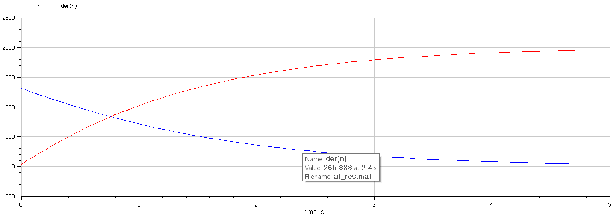
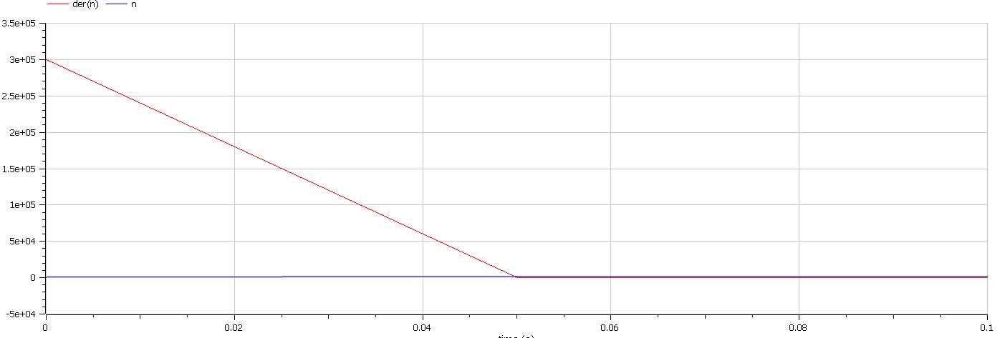
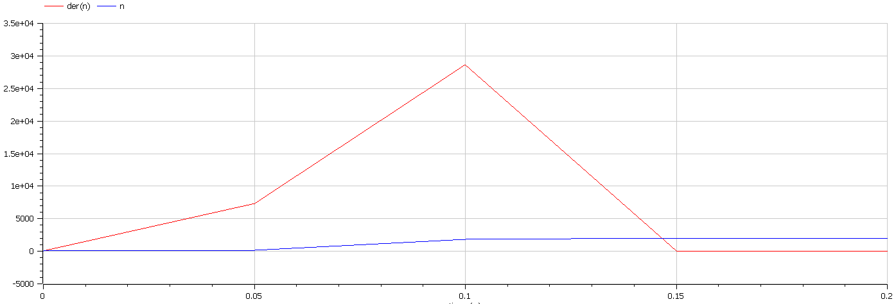

<!--_class: titleslide1 -->
#### Автор лабараторной работы

##### Сыров Владислав Андреевич

группа: НКНбд-01-19
ст.билет: 10321912889

---
<!--_class: titleslide1 -->
#### Цель лабораторной работы

Изучить модель эффективности рекламы

---
<!--_class: titleslide1 -->
#### Задание к лабораторной работе

1.	Изучить модель эфеективности рекламы
2.	Построить графики распространения рекламы в заданных случайх
3.	Определить для случая 2 момент времени, в который скорость распространения рекламы будет максимальной

---
<!--_class: titleslide -->
#### Условие задачи

Постройте график распространения рекламы, математическая модель которой описывается следующим уравнением:

1.	$\frac{dn}{dt} = (0.25 + 0.000075n(t))(N-n(t))$
2.	$\frac{dn}{dt} = (0.000075 + 0.25n(t))(N-n(t))$
3.	$\frac{dn}{dt} = (0.25\sin{t} + 0.75 t n(t))(N-n(t))$

При этом объем аудитории $N = 1130$, в начальный момент о товаре знает 11 человек.

Для случая 2 определите в какой момент времени скорость распространения рекламы будет иметь максимальное значение.

---
<!--_class: titleslide -->
#### График в первом случае

рис.01

---
<!--_class: titleslide -->
#### График во втором случае

рис.02

---
<!--_class: titleslide -->
#### График в третьем случае

рис.03

---
<!--_class: titleslide1 -->
#### Вывод

В ходе выполнения лабораторной работы была изучена модель эффективности рекламы и построены графики.