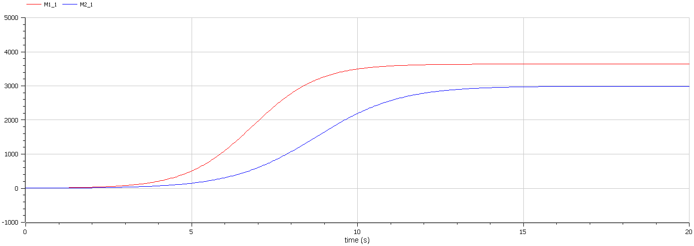
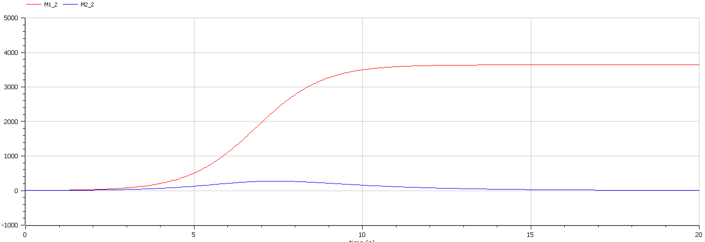

<!--_class: titleslide1 -->
#### Автор лабараторной работы

##### Сыров Владислав Андреевич

группа: НКНбд-01-19
ст.билет: 10321912889

---
<!--_class: titleslide1 -->
#### Цель лабораторной работы

Изучить модель конкуренции

---
<!--_class: titleslide1 -->
#### Задание к лабораторной работе

1.	Изучить модель конкуренции двух фирм
2.	Построить графики изменения оборотных средств в двух случаях

---
<!--_class: titleslide -->
#### Условие задачи
##### Случай 1

Рассмотрим две фирмы, производящие взаимозаменяемые товары одинакового качества и находящиеся в одной рыночной нише. Будем считать, что постоянные издержки пренебрежимо малы.

$$ \frac{dM_1}{d\Theta} = M_1 - \frac{b}{c_1}M_1 M_2 - \frac{a1}{c1} M_1^2 $$

$$ \frac{dM_2}{d\Theta} = \frac{c_2}{c_1} M_2 - \frac{b}{c_1} M_1 M_2 - \frac{a_2}{c_1} M_2^2 $$

---
<!--_class: titleslide1 -->
##### Случай 2

Рассмотрим модель, когда, помимо экономического фактора влияния  используются еще и социально-психологические факторы.

$$\frac{dM_1}{d\Theta} = M_1 - (\frac{b}{c_1} + 0.00031)M_1 M_2 - \frac{a1}{c1} M_1^2 $$

$$ \frac{dM_2}{d\Theta} = \frac{c_2}{c_1} M_2 - \frac{b}{c_1} M_1 M_2 - \frac{a_2}{c_1} M_2^2 $$

---
<!--_class: titleslide -->
#### Основные формулы

$$ a_1 = \frac{p_{cr}}{\tau_1^2 \widetilde{p}_1^2 Nq } $$
$$ a_2 = \frac{p_{cr}}{\tau_2^2 \widetilde{p}_2^2 Nq } $$ 
$$ b = \frac{p_{cr}}{\tau_1^2 \widetilde{p}_1^2 \tau_2^2 \widetilde{p}_2^2 Nq} $$
$$ c_1 = \frac{p_{cr} - \widetilde{p}_1}{\tau_1 \widetilde{p}_1} $$
$$ c_2 = \frac{p_{cr} - \widetilde{p}_2}{\tau_2 \widetilde{p}_2} $$

---
<!--_class: titleslide -->
#### Данные

$$ M_0^1=6.4 \: M_0^2=4.1 $$
$$ p_{cr}=20 \: N=40 \: q=1 $$
$$ \tau_1=20 \: \tau_2=15 $$
$$ \widetilde{p}_1=7 \: \widetilde{p}_2=9.5 $$

---
<!--_class: titleslide -->
#### График в первом случае

рис.01

---
<!--_class: titleslide -->
#### График во втором случае

рис.02

---
<!--_class: titleslide1 -->
#### Вывод

В ходе выполнения лабораторной работы была изучена модель конкуренции двух фирм и построены графики.